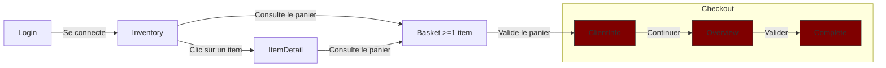

# Plan de tests du site https://www.saucedemo.com

## Contexte et Périmètre

Le site sujet aux tests automatisés de bout en bout (E2E) est une plateforme d'e-commerce en ligne à l'adresse https://www.saucedemo.com.

### Comptes disponibles

Cette plateforme d'e-commerce a un système d'authentification avec 6 noms de comptes reconnus :
- `standard_user`
- `locked_out_user`
- `problem_user`
- `performance_glitch_user`
- `error_user`
- `visual_user`

Tous les comptes énumérés ci-dessus ont le même mot de passe de connexion :
`secret_sauce`

### Écrans disponibles
La plateforme saucedemo propose l'affichage de 5 écrans principaux accessibles par les utilisateurs :
- Login
- Inventory (Liste de la totalité des items en vente)
- ItemDetail (Détail d'un item en particulier)
- Basket (Panier de commande de l'utilisateur)
- Checkout (page de paiement se distinguant en 3 étapes)
    - CheckoutClientInfo (renseignement des informations du client)
    - CheckoutOverview (résumé de la commande)
    - CheckoutComplete (information du succès de la commande, génération de la facture)

### Flow général attendu

#### Flow "aller"

#### Flow transverse
Depuis tous les écrans sauf l'écran **Login**, il est possible d'afficher un menu burger proposant un accès à l'écran **Inventory**, un logout renvoyant à l'écran **Login** et une action **Reset App State** qui nettoie le panier et toutes les autres modifications appliquées par l'utilisateur par rapport à l'écran chargé.

Comme précisé dans le diagramme ci-dessus, il est possible d'accéder au panier depuis les écrans **Inventory** et **ItemDetail**. Ce sont également par ces deux écrans que le panier peut être rempli. **Inventory** liste la totalité des items accompagnés pour chaque card un bouton "Add to cart". L'écran **ItemDetail** possède le même bouton, ajoutant l'item sélectionné au panier. Ce bouton change en "Remove" si l'item est déjà présent dans le panier du client.

L'écran **Basket** possède également le bouton "Remove". En plus de valider le panier et de passer au **Checkout**, il a un bouton "Continue Shopping" qui renvoie vers l'écran **Inventory**.

Les trois écrans de **Checkout** ont un bouton **Cancel** ou **Back Home** renvoyant vers l'écran **Inventory**.

Le troisième écran de **Checkout** étant **CheckoutComplete** dispose d'un second bouton permettant de télécharger la facture de la commande effectuée sous format PDF. Le PDF est alors téléchargé chez le client, regroupant les informations client renseignées dans **CheckoutClientInfo**, la date de la commande et le détail de la commande présent dans **CheckoutOverview**.

## Priorisation des besoins
[TBD]

## Matrice de traçabilité
[TBD]

## Scénarios détaillés par écran
[TBD]