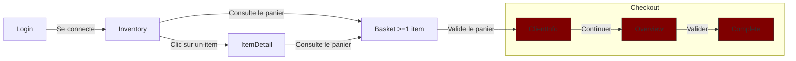

# Plan de tests E2E du site https://www.saucedemo.com

## Contexte et Périmètre

Le site sujet aux tests automatisés de bout en bout (E2E) est une plateforme d'e-commerce en ligne à l'adresse https://www.saucedemo.com.

### Comptes disponibles

Cette plateforme d'e-commerce a un système d'authentification avec 6 noms de comptes reconnus :
- `standard_user`
- `locked_out_user`
- `problem_user`
- `performance_glitch_user`
- `error_user`
- `visual_user`

Tous les comptes énumérés ci-dessus ont le même mot de passe de connexion :
`secret_sauce`

### Écrans disponibles
La plateforme saucedemo propose l'affichage de 5 écrans principaux accessibles par les utilisateurs :
- Login
- Inventory (Liste de la totalité des items en vente)
- ItemDetail (Détail d'un item en particulier)
- Basket (Panier de commande de l'utilisateur)
- Checkout (page de paiement se distinguant en 3 étapes)
    - CheckoutClientInfo (renseignement des informations du client)
    - CheckoutOverview (résumé de la commande)
    - CheckoutComplete (information du succès de la commande, génération de la facture)

### Flow général attendu

#### Flow "aller"

#### Flow transverse
Depuis tous les écrans sauf l'écran **Login**, il est possible d'afficher un menu burger proposant un accès à l'écran **Inventory**, un logout renvoyant à l'écran **Login** et une action **Reset App State** qui nettoie le panier et toutes les autres modifications appliquées par l'utilisateur par rapport à l'écran chargé.

Comme précisé dans le diagramme ci-dessus, il est possible d'accéder au panier depuis les écrans **Inventory** et **ItemDetail**. Ce sont également par ces deux écrans que le panier peut être rempli. **Inventory** liste la totalité des items accompagnés pour chaque card un bouton "Add to cart". L'écran **ItemDetail** possède le même bouton, ajoutant l'item sélectionné au panier. Ce bouton change en "Remove" si l'item est déjà présent dans le panier du client.

L'écran **Basket** possède également le bouton "Remove". En plus de valider le panier et de passer au **Checkout**, il a un bouton "Continue Shopping" qui renvoie vers l'écran **Inventory**.

Les trois écrans de **Checkout** ont un bouton **Cancel** ou **Back Home** renvoyant vers l'écran **Inventory**.

Le troisième écran de **Checkout** étant **CheckoutComplete** dispose d'un second bouton permettant de télécharger la facture de la commande effectuée sous format PDF. Le PDF est alors téléchargé chez le client, regroupant les informations client renseignées dans **CheckoutClientInfo**, la date de la commande et le détail de la commande présent dans **CheckoutOverview**.

## Priorisation des besoins
1. **Checkout** : L'objectif principal du site est de vendre des produits. Si l'achat côté utilisateur bug, cela pourrait venir de différents facteurs et l'utilisateur ne pensera probablement pas à signaler l'erreur = Risque silencieux + perte côté business invisible au début.
2. **Login** : La connexion avec un compte fonctionnel est primordiale pour le flow du site et permettre aux utilisateurs d'acheter. Bien que ce besoin soit extrêment prioritaire, il est jugé moins prioritaire que le besoin du Checkout : Risque facilement identifiable (chute de trafic)
3. **Inventory** : Impact sur la confiance et la décision d'achat. Risque non-bloquant
4. **Basket** : Faible valeur ajoutée propre. Pas d'affichage du total, actions redondantes avec Inventory et ItemDetail (remove item) : risque non bloquant.
5. **ItemDetail** : Les fonctionnalités proposées sont toutes accessibles à partir d'autres écrans (Inventory & Basket)

## Données de test
### Comptes d'authentification
|        Username         |   Password   |                                                                                             Remarque                                                                                              |
|:-----------------------:|:------------:|:-------------------------------------------------------------------------------------------------------------------------------------------------------------------------------------------------:|
|      standard_user      | secret_sauce |                                                              Compte référent. Il sert à visualiser le comportement attendu du site.                                                               |
|     locked_out_user     | secret_sauce |                                                                          Compte bloqué. Il ne peut plus s'authentifier.                                                                           |
|      problem_user       | secret_sauce | Plusieurs erreurs sur la gestion du panier (ajout / retrait d'items) et l'affichage de la liste des Items ur l'écran Inventory. Il ne peut pas aller plus loin que l'écran CheckoutClientInfo. |
| performance_glitch_user | secret_sauce |                                                          Compte "laggy". Il consomme plus de ressources pour afficher la page Inventory.                                                          |
|       error_user        | secret_sauce |                                                                     Il n'arrive pas à aller au bout de la commande des items.                                                                     |
|       visual_user       | secret_sauce |                                                               Il n'affiche pas ce qui est attendu. Éléments retournés / mal placés.                                                               |

### Produits en vente
La liste des produits en vente est basée sur l'observable du compte `standard_user`.

La colonne d'ID permet uniquement d'éviter les doublons pour les jeux de données de test des écrans Inventory et ItemDetail. Elle ne sert pas de champ de test.

|  ID   |                Nom                |  Prix  |                                                                                                          Description                                                                                                           |                                                Illustration (URL)                                                |
|:-----:|:---------------------------------:|:------:|:------------------------------------------------------------------------------------------------------------------------------------------------------------------------------------------------------------------------------:|:----------------------------------------------------------------------------------------------------------------:|
|   0   |       Sauce Labs Bike Light       | $9.99  |                                A red light isn't the desired state in testing but it sure helps when riding your bike at night. Water-resistant with 3 lighting modes, 1 AAA battery included.                                 | [Phare avant de vélo de marque "Star Union"](https://www.saucedemo.com/assets/bike-light-1200x1500-DxcZRFOA.jpg) |
|   1   |      Sauce Labs Bolt T-Shirt      | $15.99 |                                        Get your testing superhero on with the Sauce Labs bolt T-shirt. From American Apparel, 100% ringspun combed cotton, heather gray with red bolt.                                         |            [T-Shirt Noir cintré](https://www.saucedemo.com/assets/bolt-shirt-1200x1500-mR0ldpVS.jpg)             |
|   2   |         Sauce Labs Onesie         | $7.99  |                                Rib snap infant onesie for the junior automation engineer in development. Reinforced 3-snap bottom closure, two-needle hemmed sleeved and bottom won't unravel.                                 |            [Body blanc pour bébé](https://www.saucedemo.com/assets/red-onesie-1200x1500-BrSuq0ic.jpg)            |
|   3   | Test.allTheThings() T-Shirt (Red) | $15.99 |                                   This classic Sauce Labs t-shirt is perfect to wear when cozying up to your keyboard to automate a few tests. Super-soft and comfy ringspun combed cotton.                                    |        [Haut à manches longues, orangé](https://www.saucedemo.com/assets/red-tatt-1200x1500-E-qp6aYf.jpg)        |
|   4   |        Sauce Labs Backpack        | $29.99 |                                             carry.allTheThings() with the sleek, streamlined Sly Pack that melds uncompromising style with unequaled laptop and tablet protection.                                             |             [Sac à dos noir](https://www.saucedemo.com/assets/sauce-backpack-1200x1500-CjRW-Djj.jpg)             |
|   5   |     Sauce Labs Fleece Jacket      | $49.99 |                             It's not every day that you come across a midweight quarter-zip fleece jacket capable of handling everything from a relaxing day outdoors to a busy day at the office.                             |         [Hoodie en laine grise](https://www.saucedemo.com/assets/sauce-pullover-1200x1500-BfbI-PSd.jpg)          |
| Autre |          ITEM NOT FOUND           |  $√-1  | We're sorry, but your call could not be completed as dialled. Please check your number, and try your call again. If you are in need of assistance, please dial 0 to be connected with an operator. This is a recording. 4 T 1. |                [Chien récupérant la balle](https://www.saucedemo.com/assets/sl-404-Cq1a9k9X.jpg)                 |

## Matrice de traçabilité
|       Écran        |                           Compte(s) pertinent(s)                           |  Priorité  |
|:------------------:|:--------------------------------------------------------------------------:|:----------:|
|       Login        | standard locked_out problem performance_glitch error visual | Très Haute |
|     Inventory      |        standard problem performance_glitch error visual        |   Haute    |
|     ItemDetail     |        standard problem performance_glitch error visual        | Très Basse |
|       Basket       |        standard problem performance_glitch error visual        |   Basse    |
| CheckoutClientInfo |        standard problem performance_glitch error visual        |  Critique  |
|  CheckoutOverview  |             standard performance_glitch error visual              |  Critique  |
|  CheckoutComplete  |                  standard performance_glitch visual                  |  Critique  |

## Scénarios détaillés par écran
### Login
|                             Scénario                              |                    Compte(s) concerné(s)                     |                                            Résultat Attendu                                             |
|:-----------------------------------------------------------------:|:------------------------------------------------------------:|:-------------------------------------------------------------------------------------------------------:|
|         Nom d'utilisateur valide Mot de passe correct          | standard problem performance_glitch error visual |                         Redirection vers Inventory Cookie d'authentification                         |
| Nom d'utilisateur valide Mot de passe correct Compte bloqué |                          locked_out                          | Message d'erreur informant le blocage du compte BUG : Cookie d'authentification tout de même présent |
|        Nom d'utilisateur invalide Mot de passe correct         |                              *                               |               Message d'erreur informant que le combo des deux identifiants est incorrect               |
|        Nom d'utilisateur valide Mot de passe incorrect         |                              *                               |               Message d'erreur informant que le combo des deux identifiants est incorrect               |
|       Nom d'utilisateur invalide Mot de passe incorrect        |                              *                               |               Message d'erreur informant que le combo des deux identifiants est incorrect               |
|            Nom d'utilisateur vide Mot de passe vide            |                              *                               |                             Message d'erreur demandant le nom d'utilisateur                             |
|         Nom d'utilisateur vide Mot de passe incorrect          |                              *                               |                             Message d'erreur demandant le nom d'utilisateur                             |
|          Nom d'utilisateur vide Mot de passe correct           |                              *                               |                             Message d'erreur demandant le nom d'utilisateur                             |
|          Nom d'utilisateur invalide Mot de passe vide          |                              *                               |                               Message d'erreur demandant le mot de passe                                |
|           Nom d'utilisateur valide Mot de passe vide           |                              *                               |                               Message d'erreur demandant le mot de passe                                |

### Inventory
*A partir de cet écran, `*` englobe tous les comptes sauf `locked_out_user`, qui ne peut pas avancer depuis le Login.*

Un tableau par fonctionnalité

#### Chargement de la page
|            Scénario            |          Compte(s) concerné(s)          |                     Résultat Attendu                      |
|:------------------------------:|:---------------------------------------:|:---------------------------------------------------------:|
| Temps de chargement de la page | standard problem error visual  |                   Page chargée < 1 sec                    |
| Temps de chargement de la page |           performance_glitch            |   BUG : Temps de chargement anormalement élevé > 4 sec    |
| Affichage de la liste d'items  |                    *                    |              6 Items affichés avec leur prix              |
| Affichage de la liste d'items  | standard error performance_glitch |     Données des items cohérentes avec celles relevées     |
| Affichage de la liste d'items  |            problem visual            | BUG : Données des items incohérentes avec celles relevées |

#### Ouverture Sidebar menu
|                           Scénario                           | Compte(s) concerné(s) |                   Résultat Attendu                    |
|:------------------------------------------------------------:|:---------------------:|:-----------------------------------------------------:|
| Clic sur les 3 barres horizontales situées au topleft corner |           *           |                    Sidebar ouverte                    |
|               Déconnexion par clic sur Logout                |           *           | Suppression du cookie d'auth + redirection vers Login |

#### Tri des items
|                        Scénario                        | Compte(s) concerné(s) |                                             Résultat Attendu                                              |
|:------------------------------------------------------:|:---------------------:|:---------------------------------------------------------------------------------------------------------:|
|              Select + par défaut Tri A-Z               |           *           |                         Obtenir la liste des 6 items triés par ordre alphabétique                         |
|                     Select Tri Z-A                     |           *           |                   Obtenir la liste des 6 items triés par ordre alphabétique décroissant                   |
|                  Select Tri High-Low                   |           *           |                     Obtenir la liste des 6 items triés par valeur du prix décroissant                     |
|                  Select Tri Low-High                   |           *           |                      Obtenir la liste des 6 items triés par valeur du prix croissant                      |
|          Select qu'importe la méthode de tri           |        problem        |            BUG : Aucun changement de valeur du select, aucun changement de la liste des items             |
|          Select qu'importe la méthode de tri           |         error         | BUG : Boite d'alerte contenant le message "Sorting is broken! This error has been reported to Backtrace." |
| Temps de chargement du changement de la méthode de tri |  standard visual   |                                             Affichage < 1 sec                                             |
| Temps de chargement du changement de la méthode de tri |  performance_glitch   |                                          BUG : Affichage > 4 sec                                          |

#### Ajout / Retrait des items
|        Scénario        |          Compte(s) concerné(s)           |                                                           Résultat Attendu                                                            |
|:----------------------:|:----------------------------------------:|:-------------------------------------------------------------------------------------------------------------------------------------:|
| Clic sur "Add to cart" | standard performance_glitch visual |    Le panier s'incrémente Le bouton devient "Remove" Le LocalStoage est mis à jour par un tableau des IDs des items ajoutés     |
| Clic sur "Add to cart" |             problem error             |                                  BUG : Au moins un item ne répond pas, aucun comportement observable                                  |
|   Clic sur "Remove"    | standard performance_glitch visual | Le panier se décrémente Le bouton devient "Add to cart" Le LocalStoage est mis à jour par un tableau des IDs des items restants |
|   Clic sur "Remove"    |             problem error             |                                  BUG : Au moins un item ne répond pas, aucun comportement observable                                  |

#### Accès au détail des items
|             Scénario              |               Compte(s) concerné(s)               |                                   Résultat Attendu                                   |
|:---------------------------------:|:-------------------------------------------------:|:------------------------------------------------------------------------------------:|
|    Clic sur le titre d'un item    | standard performance_glitch error visual |         Renvoi vers ItemDetail avec l'ID de l'item en param de l'URL (?id=X)         |
|    Clic sur le titre d'un item    |                      problem                      | BUG : Renvoi vers ItemDetail d'un autre ID en param de l'URL (?id=X) / un ID inconnu |
| Clic sur l'illustration d'un item | standard performance_glitch error visual |         Renvoi vers ItemDetail avec l'ID de l'item en param de l'URL (?id=X)         |
| Clic sur l'illustration d'un item |                      problem                      | BUG : Renvoi vers ItemDetail d'un autre ID en param de l'URL (?id=X) / un ID inconnu |

#### Accès au panier
|               Scénario                |               Compte(s) concerné(s)                |                          Résultat Attendu                          |
|:-------------------------------------:|:--------------------------------------------------:|:------------------------------------------------------------------:|
|      Clic sur l'icône du panier       |                         *                          |                         Renvoi vers Basket                         |
| Affichage des items ajoutés au panier | standard problem performance_glitch error |               Cohérent avec l'observable d'Inventory               |
| Affichage des items ajoutés au panier |                       visual                       | BUG : Incohérent avec l'observable d'Inventory (vrai prix affiché) |

### ItemDetail
#### Cohérence des données affichées
|                Scénario                |                Compte(s) concerné(s)                |                Résultat Attendu                 |
|:--------------------------------------:|:---------------------------------------------------:|:-----------------------------------------------:|
|     Affichage du titre selon l'ID      |                          *                          |     Titre cohérent avec les données de test     |
| Affichage de l'illustration selon l'ID |                          *                          | Illustration cohérente avec les données de test |
|      Affichage du prix selon l'ID      |                          *                          |     Prix cohérent avec les données de test      |
| Affichage de la description selon l'ID | standard problem performance_glitch visual | Description cohérente avec les données de test  |
| Affichage de la description selon l'ID |                        error                        |        BUG : Pas de description affichée        |

#### Ajout / Retrait du panier
|        Scénario        |          Compte(s) concerné(s)           |                                                           Résultat Attendu                                                            |
|:----------------------:|:----------------------------------------:|:-------------------------------------------------------------------------------------------------------------------------------------:|
| Clic sur "Add to cart" | standard performance_glitch visual |    Le panier s'incrémente Le bouton devient "Remove" Le LocalStoage est mis à jour par un tableau des IDs des items ajoutés     |
| Clic sur "Add to cart" |             problem error             |                               BUG : Au moins un ID d'item ne répond pas, aucun comportement observable                                |
|   Clic sur "Remove"    | standard performance_glitch visual | Le panier se décrémente Le bouton devient "Add to cart" Le LocalStoage est mis à jour par un tableau des IDs des items restants |
|   Clic sur "Remove"    |             problem error             |                               BUG : Au moins un ID d'item ne répond pas, aucun comportement observable                                |

#### Accès à un ID inconnu
|          Scénario           |                Compte(s) concerné(s)                |                                                                       Résultat Attendu                                                                       |
|:---------------------------:|:---------------------------------------------------:|:------------------------------------------------------------------------------------------------------------------------------------------------------------:|
|     Affichage du titre      |                          *                          |                                                                   Affiche "Item not found"                                                                   |
| Affichage de la description | standard problem performance_glitch visual |                                                            Affiche la description de l'id "Autre"                                                            |
| Affichage de la description |                        error                        |                                                              BUG : Pas de description affichée                                                               |
| Affichage de l'illustration |                          *                          |                                                            Affiche l'illustration de l'id "Autre"                                                            |
|      Affichage du prix      |                          *                          |                                                               Affiche le prix de l'id "Autre"                                                                |
|   Clic sur "Add to cart"    |                          *                          | BUG : Le panier s'incrémente Le bouton devient "Remove" Le LocalStoage est mis à jour par un tableau des IDs des items ajoutés avec l'ID fictif en URL |
|      Clic sur "Remove"      |      standard performance_glitch visual       |            Le panier se décrémente Le bouton devient "Add to cart" Le LocalStoage est mis à jour par un tableau des IDs des items restants             |
|      Clic sur "Remove"      |                  problem error                   |                                                             BUG : Aucun comportement observable                                                              |

#### Navigation
|          Scénario           | Compte(s) concerné(s) |   Résultat Attendu    |
|:---------------------------:|:---------------------:|:---------------------:|
| Clic sur "Back to products" |           *           | Renvoi vers Inventory |

### Basket
#### Consultation du panier
|               Scénario                | Compte(s) concerné(s) |                        Résultat Attendu                        |
|:-------------------------------------:|:---------------------:|:--------------------------------------------------------------:|
|     Affichage des items du panier     |           *           |          Données cohérentes avec les données de test           |
|    Panier vide (aucun item ajouté)    |           *           |                 Aucun item affiché, écran vide                 |
| Visualiser item ajouté via ID inconnu |           *           | BUG : Compteur incrémenté, mais aucun item affiché dans Basket |

#### Retrait d'un item
|     Scénario      | Compte(s) concerné(s) |                                                         Résultat Attendu                                                         |
|:-----------------:|:---------------------:|:--------------------------------------------------------------------------------------------------------------------------------:|
| Clic sur "Remove" |           *           | L'item disparaît de la liste, le panier se décrémente Le LocalStoage est mis à jour par un tableau des IDs des items restants |

#### Navigation
|           Scénario           | Compte(s) concerné(s) |        Résultat Attendu        |
|:----------------------------:|:---------------------:|:------------------------------:|
| Clic sur "Continue Shopping" |           *           |     Renvoi vers Inventory      |
|     Clic sur "Checkout"      |           *           | Renvoi vers CheckoutClientInfo |

### CheckoutClientInfo

#### Validation des champs (standard_user, performance_glitch_user, visual_user)
| First Name | Last Name | Zip Code |         Résultat Attendu          |
|:----------:|:---------:|:--------:|:---------------------------------:|
|    Vide    |   Vide    |   Vide   |   Error: First Name is required   |
|    Vide    |   Vide    |  Rempli  |   Error: First Name is required   |
|    Vide    |  Rempli   |   Vide   |   Error: First Name is required   |
|    Vide    |  Rempli   |  Rempli  |   Error: First Name is required   |
|   Rempli   |   Vide    |   Vide   |   Error: Last Name is required    |
|   Rempli   |   Vide    |  Rempli  |   Error: Last Name is required    |
|   Rempli   |  Rempli   |   Vide   |  Error: Postal Code is required   |
|   Rempli   |  Rempli   |  Rempli  | Redirection vers CheckoutOverview |

#### Comportements spécifiques par compte
|      Scénario       | Compte(s) concerné(s) |                                                          Résultat Attendu                                                          |
|:-------------------:|:---------------------:|:----------------------------------------------------------------------------------------------------------------------------------:|
| Saisie du Last Name |        problem        | BUG : Chaque caractère tapé dans Last Name remplace First Name Last Name reste vide, validation bloquée "Last Name is required" |
| Saisie du Last Name |         error         |                           BUG : Last Name reste vide (silencieux) mais redirection vers CheckoutOverview                           |

#### Validation du format Zip Code
|                     Scénario                      | Compte(s) concerné(s) |                 Résultat Attendu                 |
|:-------------------------------------------------:|:---------------------:|:------------------------------------------------:|
| Saisie de caractères non-numériques dans Zip Code |           *           | BUG : Aucune restriction, tout caractère accepté |

### CheckoutOverview

#### Affichage du résumé (comportement standard)
|              Scénario              |               Compte(s) concerné(s)               |                            Résultat Attendu                             |
|:----------------------------------:|:-------------------------------------------------:|:-----------------------------------------------------------------------:|
|   Affichage des items du panier    | standard performance_glitch error visual | Liste cohérente avec le panier : quantité (1), titre, description, prix |
|     Titre cliquable d'un item      | standard performance_glitch error visual |                   Renvoi vers ItemDetail du bon item                    |
| Affichage infos paiement/livraison |                         *                         |   "SauceCard #31337" / "Free Pony Express Delivery!" (valeurs fixes)    |
|        Calcul du sous-total        | standard performance_glitch error visual |                 Somme exacte des prix des items listés                  |
|         Calcul de la taxe          |                         *                         |                        8% du sous-total affiché                         |
|          Calcul du total           |                         *                         |                            Sous-total + taxe                            |

#### Comportements spécifiques
|                                   Scénario                                   | Compte(s) concerné(s) |                                                         Résultat Attendu                                                         |
|:----------------------------------------------------------------------------:|:---------------------:|:--------------------------------------------------------------------------------------------------------------------------------:|
|                               Accès à l'écran                                |        problem        |                       BUG : Accessible via URL directe (checkout-step-two.html) en contournant ClientInfo                        |
|                             Calcul du sous-total                             |        problem        |         BUG : Sous-total affiché ne correspond pas à la somme réelle des items listés (observé : double du montant réel)         |
|                               Accès à l'écran                                |         error         |                                         Accessible normalement, items et prix cohérents                                          |
| Manipulation LocalStorage Panier contenant un ID dupliqué (ex: [0, 0, 4]) |           *           | BUG : L'item apparaît en double (2 cards distinctes), quantité affichée à 1 sur chacune plutôt qu'une seule card avec quantité 2 |

#### Navigation
|     Scénario      |          Compte(s) concerné(s)           |                          Résultat Attendu                          |
|:-----------------:|:----------------------------------------:|:------------------------------------------------------------------:|
| Clic sur "Cancel" |                    *                     |       Redirection vers Inventory, panier conservé (non vidé)       |
| Clic sur "Finish" | standard performance_glitch visual |                 Redirection vers CheckoutComplete                  |
| Clic sur "Finish" |                  error                   | BUG : erreur silencieuse, aucune redirection vers CheckoutComplete |

### CheckoutComplete

#### Affichage de la confirmation
|        Scénario         |          Compte(s) concerné(s)           |                                                     Résultat Attendu                                                     |
|:-----------------------:|:----------------------------------------:|:------------------------------------------------------------------------------------------------------------------------:|
| Message de confirmation | standard performance_glitch visual | "Thank you for your order!" "Your order has been dispatched, and will arrive just as fast as the pony can get there!" |

#### Génération du PDF
|            Scénario            |          Compte(s) concerné(s)           |                                  Résultat Attendu                                   |
|:------------------------------:|:----------------------------------------:|:-----------------------------------------------------------------------------------:|
| Contenu du PDF : infos client  | standard performance_glitch visual | Prénom/Nom/Code Postal renseignés à l'étape CheckoutClientInfo présents dans le PDF |
|     Contenu du PDF : date      | standard performance_glitch visual |                    Date cohérente avec le moment de la commande                     |
| Contenu du PDF : items et prix | standard performance_glitch visual | Liste des items, prix, sous-total, taxe (8% du ST), total cohérents avec l'Overview |

#### Navigation
|            Scénario            |          Compte(s) concerné(s)           |               Résultat Attendu                |
|:------------------------------:|:----------------------------------------:|:---------------------------------------------:|
| Chargement de CheckoutComplete | standard performance_glitch visual |      Le panier est vidé automatiquement       |
|      Clic sur "Back Home"      | standard performance_glitch visual | Redirection vers Inventory (panier déjà vide) |

Bon, on regroupe tout ce qu'on avait mis de côté pendant la session. Voici la structure proposée :

### Transverse

#### Accès sans authentification
|                      Scénario                      | Compte(s) concerné(s) |                                Résultat Attendu                                |
|:--------------------------------------------------:|:---------------------:|:------------------------------------------------------------------------------:|
| Accès direct à une URL protégée sans cookie d'auth |           *           | Redirection vers Login You can only access '/X.html' when you are logged in |

#### Menu burger
|          Scénario           | Compte(s) concerné(s) |                   Résultat Attendu                    |
|:---------------------------:|:---------------------:|:-----------------------------------------------------:|
| Ouverture/fermeture du menu |           *           |               Sidebar s'ouvre/se ferme                |
|    Clic sur "All Items"     |           *           |              Redirection vers Inventory               |
|      Clic sur "Logout"      |           *           | Suppression du cookie d'auth, redirection vers Login  |
| Clic sur "Reset App State"  |           *           | Panier vidé, modifications utilisateur réinitialisées |

#### Anomalies visuelles
|       Élément affecté        | Compte(s) concerné(s) |                                 Résultat Attendu                                 |
|:----------------------------:|:---------------------:|:--------------------------------------------------------------------------------:|
|      Bouton menu burger      |        visual         |                 BUG : rotation ~3deg (classe `.visual_failure`)                  |
|     Items sur Inventory      |        visual         |                 BUG : rotation ~3deg (classe `.visual_failure`)                  |
| Bouton "Checkout" sur Basket |        visual         | BUG : positionné en haut à droite au lieu d'en bas (classe `btn_visual_failure`) |
