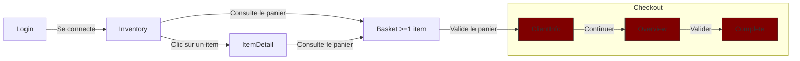

# Plan de tests du site https://www.saucedemo.com

## Contexte et Périmètre

Le site sujet aux tests automatisés de bout en bout (E2E) est une plateforme d'e-commerce en ligne à l'adresse https://www.saucedemo.com.

### Comptes disponibles

Cette plateforme d'e-commerce a un système d'authentification avec 6 noms de comptes reconnus :
- `standard_user`
- `locked_out_user`
- `problem_user`
- `performance_glitch_user`
- `error_user`
- `visual_user`

Tous les comptes énumérés ci-dessus ont le même mot de passe de connexion :
`secret_sauce`

### Écrans disponibles
La plateforme saucedemo propose l'affichage de 5 écrans principaux accessibles par les utilisateurs :
- Login
- Inventory (Liste de la totalité des items en vente)
- ItemDetail (Détail d'un item en particulier)
- Basket (Panier de commande de l'utilisateur)
- Checkout (page de paiement se distinguant en 3 étapes)
    - CheckoutClientInfo (renseignement des informations du client)
    - CheckoutOverview (résumé de la commande)
    - CheckoutComplete (information du succès de la commande, génération de la facture)

### Flow général attendu

#### Flow "aller"

#### Flow transverse
Depuis tous les écrans sauf l'écran **Login**, il est possible d'afficher un menu burger proposant un accès à l'écran **Inventory**, un logout renvoyant à l'écran **Login** et une action **Reset App State** qui nettoie le panier et toutes les autres modifications appliquées par l'utilisateur par rapport à l'écran chargé.

Comme précisé dans le diagramme ci-dessus, il est possible d'accéder au panier depuis les écrans **Inventory** et **ItemDetail**. Ce sont également par ces deux écrans que le panier peut être rempli. **Inventory** liste la totalité des items accompagnés pour chaque card un bouton "Add to cart". L'écran **ItemDetail** possède le même bouton, ajoutant l'item sélectionné au panier. Ce bouton change en "Remove" si l'item est déjà présent dans le panier du client.

L'écran **Basket** possède également le bouton "Remove". En plus de valider le panier et de passer au **Checkout**, il a un bouton "Continue Shopping" qui renvoie vers l'écran **Inventory**.

Les trois écrans de **Checkout** ont un bouton **Cancel** ou **Back Home** renvoyant vers l'écran **Inventory**.

Le troisième écran de **Checkout** étant **CheckoutComplete** dispose d'un second bouton permettant de télécharger la facture de la commande effectuée sous format PDF. Le PDF est alors téléchargé chez le client, regroupant les informations client renseignées dans **CheckoutClientInfo**, la date de la commande et le détail de la commande présent dans **CheckoutOverview**.

## Priorisation des besoins
1. **Checkout** : L'objectif principal du site est de vendre des produits. Si l'achat côté utilisateur bug, cela pourrait venir de différents facteurs et l'utilisateur ne pensera probablement pas à signaler l'erreur = Risque silencieux + perte côté business invisible au début.
2. **Login** : La connexion avec un compte fonctionnel est primordiale pour le flow du site et permettre aux utilisateurs d'acheter. Bien que ce besoin soit extrêment prioritaire, il est jugé moins prioritaire que le besoin du Checkout : Risque facilement identifiable (chute de trafic)
3. **Inventory** : Impact sur la confiance et la décision d'achat. Risque non-bloquant
4. **Basket** : Faible valeur ajoutée propre. Pas d'affichage du total, actions redondantes avec Inventory et ItemDetail (remove item) : risque non bloquant.
5. **ItemDetail** : Les fonctionnalités proposées sont toutes accessibles à partir d'autres écrans (Inventory & Basket)

## Données de test
### Comptes d'authentification
|        Username         |   Password   |                                                                                             Remarque                                                                                              |
|:-----------------------:|:------------:|:-------------------------------------------------------------------------------------------------------------------------------------------------------------------------------------------------:|
|      standard_user      | secret_sauce |                                                              Compte référent. Il sert à visualiser le comportement attendu du site.                                                               |
|     locked_out_user     | secret_sauce |                                                                          Compte bloqué. Il ne peut plus s'authentifier.                                                                           |
|      problem_user       | secret_sauce | Plusieurs erreurs sur la gestion du panier (ajout / retrait d'items) et l'affichage de la liste des Items ur l'écran Inventory. Il ne peut pas aller plus loin que l'écran CheckoutClientInfo. |
| performance_glitch_user | secret_sauce |                                                          Compte "laggy". Il consomme plus de ressources pour afficher la page Inventory.                                                          |
|       error_user        | secret_sauce |                                                                     Il n'arrive pas à aller au bout de la commande des items.                                                                     |
|       visual_user       | secret_sauce |                                                               Il n'affiche pas ce qui est attendu. Éléments retournés / mal placés.                                                               |

### Produits en vente
La liste des produits en vente est basée sur l'observable du compte `standard_user`.

La colonne d'ID permet uniquement d'éviter les doublons pour les jeux de données de test des écrans Inventory et ItemDetail. Elle ne sert pas de champ de test.

| ID |                Nom                |  Prix  |                                                                              Description                                                                               |                                                Illustration (URL)                                                |
|:--:|:---------------------------------:|:------:|:----------------------------------------------------------------------------------------------------------------------------------------------------------------------:|:----------------------------------------------------------------------------------------------------------------:|
| 0  |       Sauce Labs Bike Light       | $9.99  |    A red light isn't the desired state in testing but it sure helps when riding your bike at night. Water-resistant with 3 lighting modes, 1 AAA battery included.     | [Phare avant de vélo de marque "Star Union"](https://www.saucedemo.com/assets/bike-light-1200x1500-DxcZRFOA.jpg) |
| 1  |      Sauce Labs Bolt T-Shirt      | $15.99 |            Get your testing superhero on with the Sauce Labs bolt T-shirt. From American Apparel, 100% ringspun combed cotton, heather gray with red bolt.             |            [T-Shirt Noir cintré](https://www.saucedemo.com/assets/bolt-shirt-1200x1500-mR0ldpVS.jpg)             |
| 2  |         Sauce Labs Onesie         | $7.99  |    Rib snap infant onesie for the junior automation engineer in development. Reinforced 3-snap bottom closure, two-needle hemmed sleeved and bottom won't unravel.     |            [Body blanc pour bébé](https://www.saucedemo.com/assets/red-onesie-1200x1500-BrSuq0ic.jpg)            |
| 3  | Test.allTheThings() T-Shirt (Red) | $15.99 |       This classic Sauce Labs t-shirt is perfect to wear when cozying up to your keyboard to automate a few tests. Super-soft and comfy ringspun combed cotton.        |        [Haut à manches longues, orangé](https://www.saucedemo.com/assets/red-tatt-1200x1500-E-qp6aYf.jpg)        |
| 4  |        Sauce Labs Backpack        | $29.99 |                 carry.allTheThings() with the sleek, streamlined Sly Pack that melds uncompromising style with unequaled laptop and tablet protection.                 |             [Sac à dos noir](https://www.saucedemo.com/assets/sauce-backpack-1200x1500-CjRW-Djj.jpg)             |
| 5  |     Sauce Labs Fleece Jacket      | $49.99 | It's not every day that you come across a midweight quarter-zip fleece jacket capable of handling everything from a relaxing day outdoors to a busy day at the office. |         [Hoodie en laine grise](https://www.saucedemo.com/assets/sauce-pullover-1200x1500-BfbI-PSd.jpg)          |

## Matrice de traçabilité
|       Écran        |                           Compte(s) pertinent(s)                           |  Priorité  |
|:------------------:|:--------------------------------------------------------------------------:|:----------:|
|       Login        | standard locked_out problem performance_glitch error visual | Très Haute |
|     Inventory      |        standard problem performance_glitch error visual        |   Haute    |
|     ItemDetail     |        standard problem performance_glitch error visual        | Très Basse |
|       Basket       |        standard problem performance_glitch error visual        |   Basse    |
| CheckoutClientInfo |        standard problem performance_glitch error visual        |  Critique  |
|  CheckoutOverview  |             standard performance_glitch error visual              |  Critique  |
|  CheckoutComplete  |                  standard performance_glitch visual                  |  Critique  |

## Scénarios détaillés par écran
### Login
|                             Scénario                              |                    Compte(s) concerné(s)                     |                              Résultat Attendu                               |
|:-----------------------------------------------------------------:|:------------------------------------------------------------:|:---------------------------------------------------------------------------:|
|         Nom d'utilisateur valide Mot de passe correct          | standard problem performance_glitch error visual |                         Redirection vers Inventory                          |
| Nom d'utilisateur valide Mot de passe correct Compte bloqué |                          locked_out                          |               Message d'erreur informant le blocage du compte               |
|        Nom d'utilisateur invalide Mot de passe correct         |                              *                               | Message d'erreur informant que le combo des deux identifiants est incorrect |
|        Nom d'utilisateur valide Mot de passe incorrect         |                              *                               | Message d'erreur informant que le combo des deux identifiants est incorrect |
|       Nom d'utilisateur invalide Mot de passe incorrect        |                              *                               | Message d'erreur informant que le combo des deux identifiants est incorrect |
|            Nom d'utilisateur vide Mot de passe vide            |                              *                               |               Message d'erreur demandant le nom d'utilisateur               |
|         Nom d'utilisateur vide Mot de passe incorrect          |                              *                               |               Message d'erreur demandant le nom d'utilisateur               |
|          Nom d'utilisateur vide Mot de passe correct           |                              *                               |               Message d'erreur demandant le nom d'utilisateur               |
|          Nom d'utilisateur invalide Mot de passe vide          |                              *                               |                 Message d'erreur demandant le mot de passe                  |
|           Nom d'utilisateur valide Mot de passe vide           |                              *                               |                 Message d'erreur demandant le mot de passe                  |

###